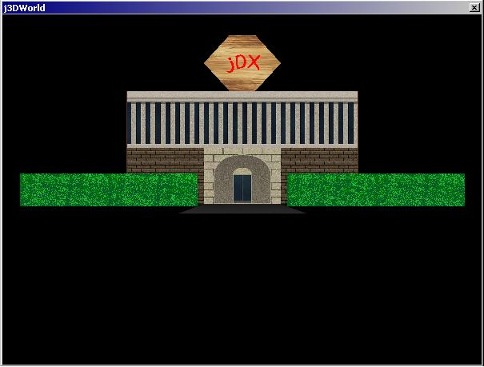



## jDXEngine v1\.1 \(DirectX Container Class\)

### Description

Welcome to another edition of jDXEngine! ;) This time, I've added extra classes to make it a bit more OO, and so that the jDXEngine class didn't have the 100+ functions that was rapidly approaching. :) This is not meant as a tutorial on how to use DirectX8, but more as a tool so that you don't HAVE to know DirectX8 to be able to create 3D gamez/appz. Operation: The arrow keys will move you forward/back and turn (remember doom?), and the "," and "." keys will strafe you left/right respectively (remember doom?). The world itself is quite small, and I have no form of collision detection so you can just walk straight through the walls and such. There is no 'boundry' so you can walk infinately in any direction, but you won't find much except for the little building. ;) Anyway, a vote would be appreciated, but I'm far more interested in your feedback. What's good? What's bad? What could be improved/added/removed? How can I implement collision detection so that you can't move through the walls and such? That kind of stuff. :) Thank you for your time in reading/downloading this, I sincerely hope you find it useful in some way. =)
 
### More Info
 
You must have VB(duh...) and DirectX8 installed on your computer for this to work. Also, I've had problems with a specific TNT video card which wouldn't create the Direct3DDevice8 object (it wouldn't even work with Simon Price's tutorials...??), so if you find that this isn't working for you, please post feedback stating your hardware configuration so I can look into these devices. Thanks. :)

             |
---                |---
**Submitted On**   |2001-08-01 11:50:56
**By**             |[Joseph T Hicks](https://github.com/Planet-Source-Code/PSCIndex/blob/master/ByAuthor/joseph-t-hicks.md)
**Level**          |Advanced
**User Rating**    |5.0 (50 globes from 10 users)
**Compatibility**  |VB 6\.0
**Category**       |[DirectX](https://github.com/Planet-Source-Code/PSCIndex/blob/master/ByCategory/directx__1-44.md)
**World**          |[Visual Basic](https://github.com/Planet-Source-Code/PSCIndex/blob/master/ByWorld/visual-basic.md)
**Archive File**   |[jDXEngine 23886812001\.zip](https://github.com/Planet-Source-Code/joseph-t-hicks-jdxengine-v1-1-directx-container-class__1-25735/archive/master.zip)

